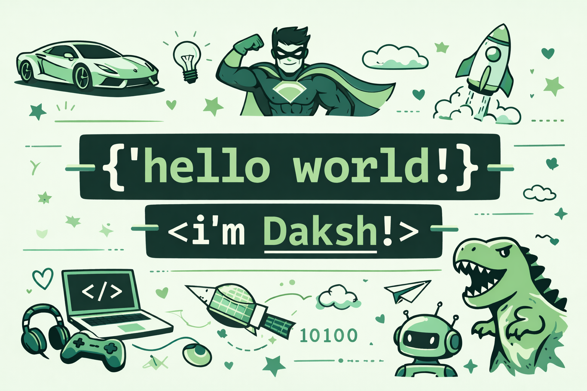

<h1 align="center">

</h1 align="center">

<h1 id="-tech-stack-">💻 Tech Stack:</h1>

     
     

<h1 id="-about-me-">💫 About Me:</h1>

<ul>
<li>📫 I&#39;m a 2nd year student at <strong>EIT (GGSIPU), FARIDABAD</strong>.</li>
<li>🌏 I&#39;m living now in <strong>Delhi, India.</strong></li>
<li>🚀 Currently sharpening my skills in <strong>Software development</strong>.</li>
<li>💡 Always curious, always improving.</li>
<li>🤝 Happy to collaborate (especially if I can just pretend I helped).</li>
<li>🧠 Fun fact: Spiders are the only web designers that are happy when they get a bug. ◑﹏◐</li>
</ul>
    

    

  

<h1 id="-connect-with-me-">🌐 Connect With ME:</h1>

.
.
.
.
 

    

  
<h1 id="Stats">⚡️ Stats</h1>

 

  
  
  

  

  

<h1 id="-github-trophies">🏆 GitHub Trophies</h1>

<h3 id="-top-contributed-repo">🔝 Top Contributed Repo</h3>

  

<h1 id="Contributions">🐍 My Contributions</h1>

*Updated - 2025-Sep-19*
